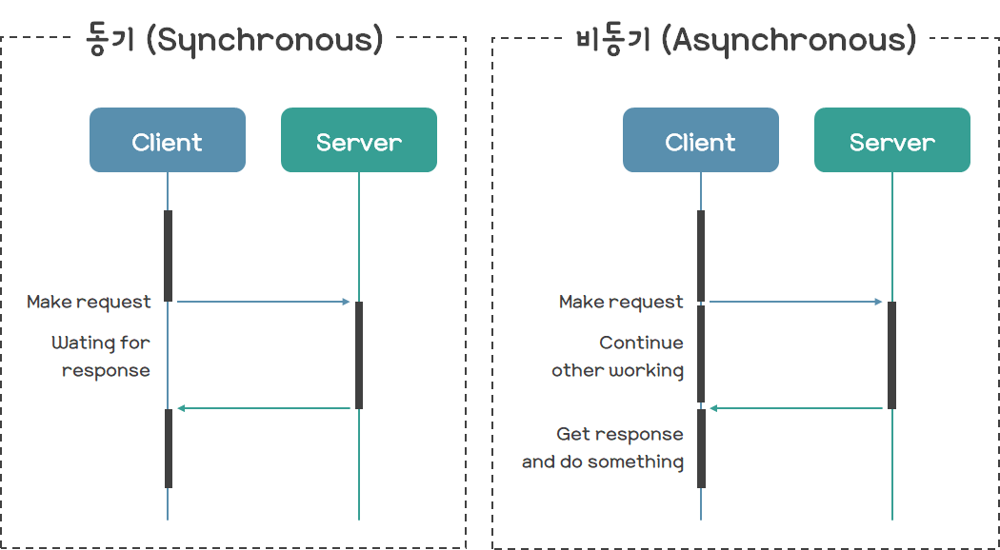
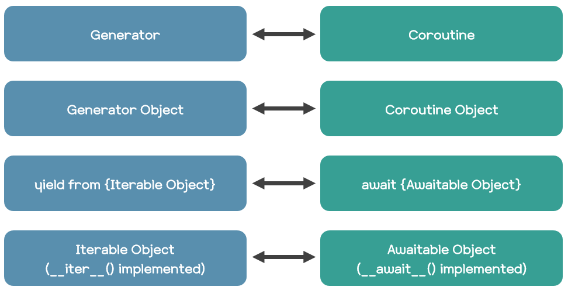
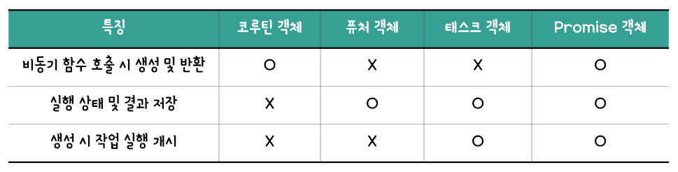
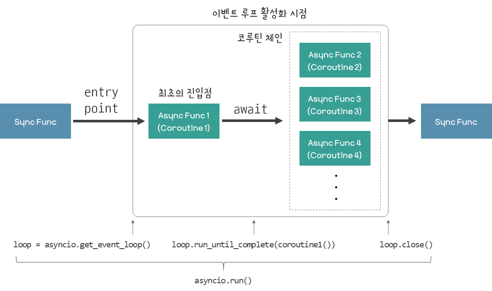
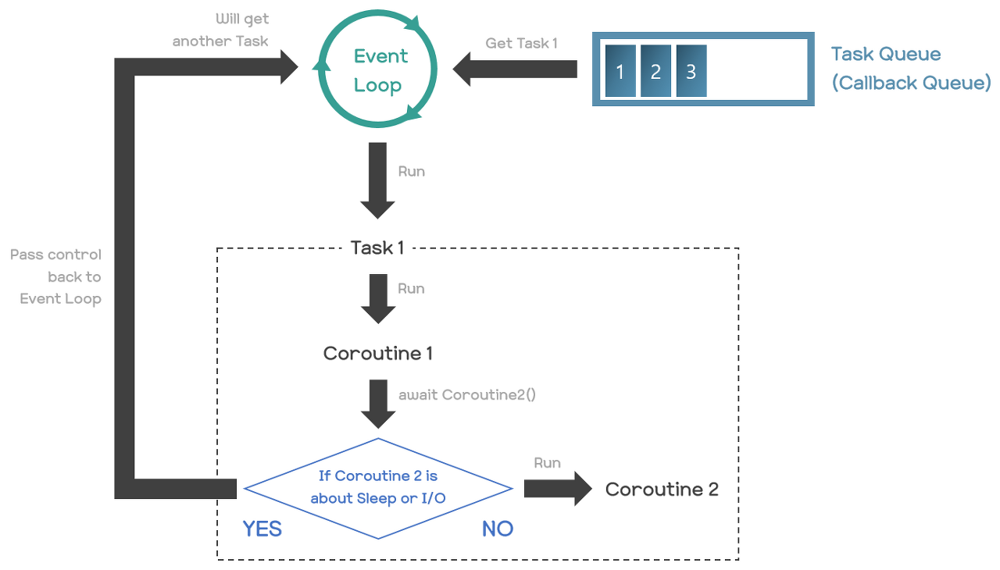

# 동기 - 비동기
2021.08.11
* * *
##### 참고사이트
+ https://it-eldorado.tistory.com/159

## 주요 개념

+ 동기 방식 : 해당 작업이 끝날 때까지 대기
+ 비동기 방식 : 해당 작업 명령 후 다른 작업을 수행



### Coroutine
+ 서브 루틴
```python
def ctf():
    print('hello sync friend')
```
+ 코루틴
```python
async def ctf()
    print('hello async friend')
```
Python에서 코루틴은 제너레이터를 기반으로 구현되었다. 제너레이터는 ```yield```를 breakpoint로 삼아 실행이 중단 및 재개될 수 있는 특징을 가지고 있다.

```async - await``` 구문으로 쉽게 비동기 방식을 구현할 수 있다. ```await``` 키워드 뒤에는 코루틴 객체뿐 아니라 ```__await__()```메소드가 구현딘 Awaitable 객체라면 무엇이든 올 수 있다. ex) Future Object, Task Object
  


**JavaScript의 Promise 객체와 다른 점**
+ JavaScript는 해당 함수가 실행되면서 Promise 객체를 반환
+ Python에서는 해당 함수가 실행되지 않고 코루틴 객체 반환


### Future, Task Object



#### Future Object

+ 어떠한 작업의 실행 상태 및 결과를 저장하는 객체
+ ```PENDING```,```CANCELLED```,```FINISHED``` 세 가지 상태 중 하나를 가짐
+ 예외가 발생한 경우에도 ```FINISHED``` 상태

```add_done_callback()``` 함수는 해당 퓨처 객체가 완료될 때 호출될 함수를 등록할 수 있다. 바로 호출 되는 것이 아닌 현재 쓰레드에 설정되어 있는 이벤트 루프에서 실행되도록 예약

#### Task Object
+ Future를 상속하는 클래스 :arrow_right: 기본적으로 퓨처 객체의 기능을 전부 가지고 있음
+ 어떠한 작업의 실행을 개시하는 역할도 수행
+ 생성 시 코루틴 객체를 넘겨받아 ```_coro```필드에 저장
+ **코루틴 객체를 갖고 있는 특별한 종류의 퓨처 객체**

## 원리

**코루틴을 실행하는 방법**
1. ```await``` 키워드
2. ```asyncio.run()``` 함수
3. ```asyncio.create_task()``` 함수

+ ```await``` 키워드는 코루틴 내에서만 사용할 수 있으므로, 엔트리 포인트로는 사용 불가
+ ```asyncio.run()```, ```asyncio.create_task()``` 함수는 코루틴 체인으로 들어가는 엔트리 포인트

```asyncio.run()``` 함수는 현재 쓰레드에 새 이벤트 루프를 설정하고, 해당 이벤트 루프에서 인자로 넘어오는 코루틴 객체애 해당하는 코루틴을 테스크로 예약하여 실행시킨 뒤, 해당 테스크의 실행이 완료되면 이벤트 루프를 닫는 역할을 수행한다

```python 
# under python3.7
loop = asyncio.get_event_loop()
loop.run_until_complete(first_coroutine())
loop.close()
```



### Task 동시 실행 : asyncio.create_task() 함수

```asyncio.run()``` 함수는 기본적으로 하나의 태스크만을 생성하여 실행한다.

따라서, 동시적인(concurrent) 실행을 위해서는 ```asyncio.create_task()``` 함수를 호출함으로써 태스크를 추가로 생성하여 실행해야한다. 
+ 즉시 실행이 아닌, 즉시 예약
+ 이 함수는 python3.7이상에서만 사용할 수 있기 때문에, 그 이전 버전에서는 ```asyncio.ensure_future()``` 함수를 대신 사용


💬 여기서 말하는 동시 실행이란 **Parallel**이 아닌 **Concurrent**를 말한다. 즉, 엄밀한 의미의 동시가 아니라 여러 태스크들을 왔다 갔다 하며 한 쓰레드에서 실행하는 개념인 것이다. 따라서 총 실행 시간은 같거나 오히려 더 늘어난다(문맥 전환 비용 때문).

```asyncio.gather()``` : 모든 퓨처 객체(태스크 객체 포함)들이 완료 상태가 될 때까지 기다리는 함수
+ 여러 개의 Awatiable 객체를 받을 수 있음
+ 코루틴 객체를 받으면 자동으로 태스크 객체로 래핑
+ 모든 퓨처 객체가 완료 상태로 되면 결과값들을 리스트형태로 반환하며 순서는 인자로 넘긴 순서와 동일
+ ```await``` 키워드 뒤에 올 수 있는 코루틴의 일종

```python
# 예시코드
import asyncio
import time

async def sleep(sec):
    await asyncio.sleep(sec)
    return sec

async def main():
    sec_list = [1, 2]
    tasks = [asyncio.create_task(sleep(sec)) for sec in sec_list]  # [Task 1 객체, Task 2 객체]
    tasks_results = await asyncio.gather(*tasks)  # [Task 1 객체의 결과 값, Task 2 객체의 결과 값]
    return tasks_results

start = time.time()

loop = asyncio.get_event_loop()
result = loop.run_until_complete(main())
loop.close()

end = time.time()

print('result : {}'.format(result))
print('total time : {0:.2f} sec'.format(end - start))

# 출력 결과
# result : [1, 2]
# total time : 2.00 sec

```

❕ 예시 코드의 실행 흐름은 [참고사이트](https://it-eldorado.tistory.com/159)에서 확인해 볼 수 있다.

### 동기 함수를 코루틴처럼 쓰기 : loop.run_in_executor() 메소드

동기 함수를 별도의 쓰레드에서 실행시킨다.

이 함수의 반환 값은 퓨처 객체이기 때문에, ```await``` 키워드 뒤에 올 수 있다.

```python
import asyncio
import time

async def sleep(sec):
    await loop.run_in_executor(None, time.sleep, sec)  # time.sleep(sec)
    return sec

async def main():
    sec_list = [1, 2]
    tasks = [asyncio.create_task(sleep(sec)) for sec in sec_list]  # [Task 1 객체, Task 2 객체]
    tasks_results = await asyncio.gather(*tasks)  # [Task 1 객체의 결과 값, Task 2 객체의 결과 값]
    return tasks_results

start = time.time()

loop = asyncio.get_event_loop()
result = loop.run_until_complete(main())
loop.close()

end = time.time()

print('result : {}'.format(result))
print('total time : {0:.2f} sec'.format(end - start))

# 출력 결과
# result : [1, 2]
# total time : 2.03 sec
```